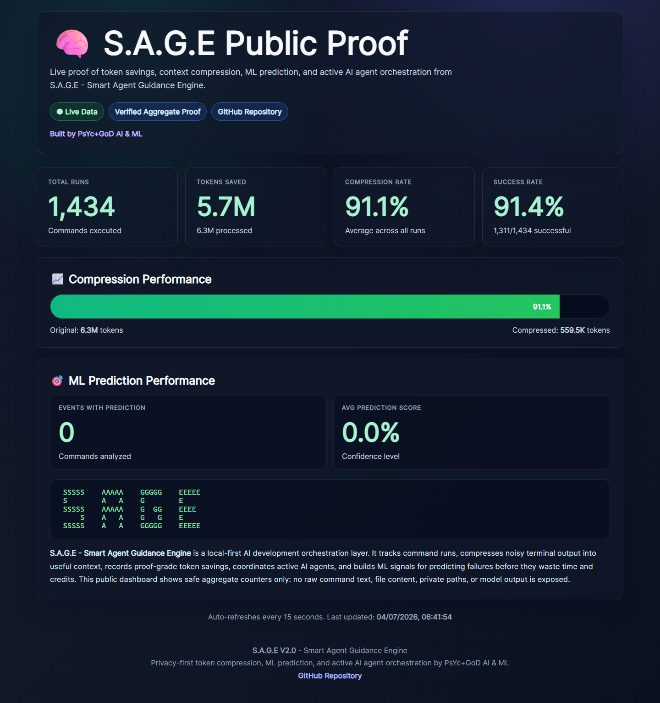

# 🧠 SAGE - Smart Agent Guidance Engine

We are all hitting the same problem with AI coding tools:

- 💸 Too many wasted tokens
- 🧱 Too much repeated context
- ⏳ Commands failing after wasting time and credits
- 🧠 No memory of what worked before
- 📚 No local learning from previous Claude, Codex, and terminal runs

I am building **SAGE - Smart Agent Guidance Engine** to help fix that.

The goal is simple: make AI development cheaper, faster, and smarter by adding:

- 🗂️ Local command memory
- 🧩 Token and context compression
- 🔮 Failure prediction before commands run
- 🤖 AI agent analysis after runs
- 📈 Local ML learning from past successes and failures
- 🔍 Better visibility into what the AI is doing
- 📊 Public proof of real token/context savings

## 📊 Live Public Proof

SAGE now has a live public proof dashboard:

**Dashboard:** https://sage.api.marketingstudios.in/dashboard

The dashboard is designed to show aggregate proof without exposing private code, command text, logs, file paths, or raw outputs.

Current proof areas:

- Total SAGE-tracked command runs
- Tokens processed, compressed, and saved
- Compression rate and success rate
- ML prediction signal from local command history
- Private owner-only visitor stats through `sage api visitors`

## 🔥 Current Local Proof Snapshot

Latest local SAGE proof snapshot while preparing the public release:

| Signal | Current Proof |
|---|---:|
| SAGE-tracked command runs | 1,455+ |
| Tokens processed | 6.3M+ |
| Tokens saved | 5.7M+ |
| Compression rate | 91%+ |
| Verified through | `sage context stats` + live proof dashboard |

These numbers keep moving as more runs go through `sage run -- <command>`.

## 📈 Current Direction

SAGE is not just another AI wrapper. It is being built as a local-first intelligence layer between developers, terminals, and AI coding tools.

Every command should become useful memory:

- What ran
- Whether it passed or failed
- How much context was saved
- Which signals mattered
- Which agent-style checks should inspect the result
- What the ML layer can learn for the next run

## 🤖 Agent Layer

SAGE tracks specialized agent-style analyzers, including code, debug, test, security, frontend, dependency, database, docs, workflow, performance, research, and release checks.

The direction is simple: not "run a command and forget it", but make every command part of a smarter development memory.

## ⚡ Why This Matters

AI tools are powerful, but developers are losing money and time because context is repeated, command output is noisy, and failures are discovered too late.

SAGE aims to reduce waste, preserve useful context, predict failures earlier, and make AI agents more useful in real development workflows.

This is still early, but I am building it in public because this problem affects almost everyone using AI for development.

If you care about reducing AI cost, improving coding workflows, or making AI agents more useful, follow along and share ideas.

Let us build something that saves everyone's time, pocket, and sanity. 🚀

## 🚧 Status

Early public announcement repo. More updates and proof data are coming as SAGE is prepared for a wider public release.
